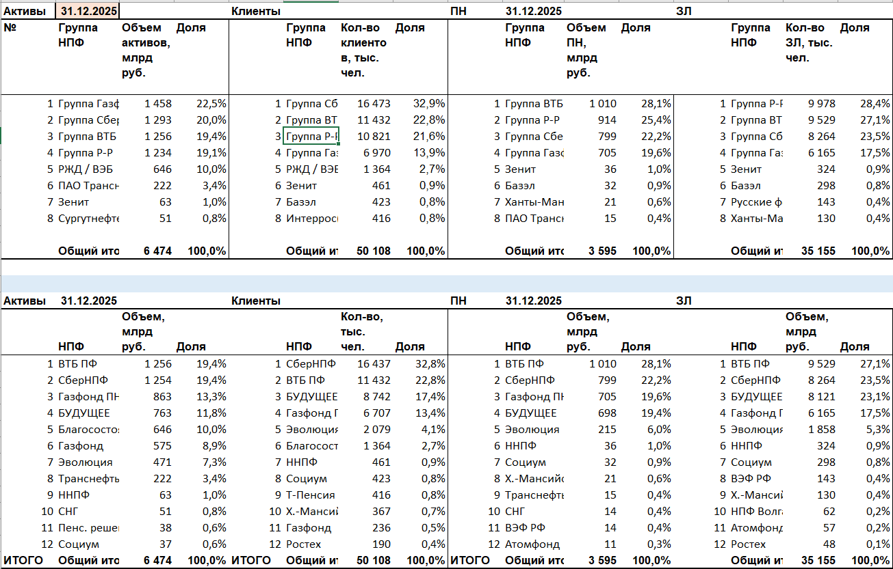
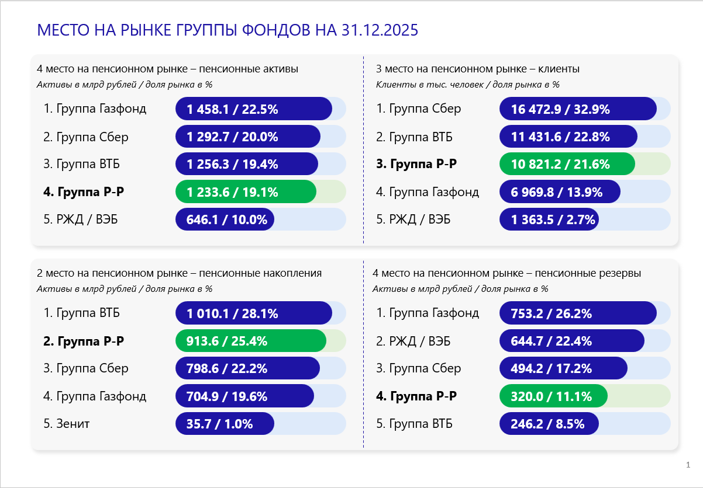

# NPF Market Monitoring and Reporting Automation

## Overview

This project automates the collection, processing, and reporting of pension fund market data.

It was developed to support analytical reporting for a Russian non-state pension fund (NPF) by eliminating repetitive manual work involved in:

* collecting market statistics from public sources;
* transforming raw disclosures into a standardized format;
* generating management presentations automatically.

The solution consists of two independent modules:

1. **HTML → Excel** — extracts and standardizes pension fund statistics from public websites.
2. **Excel → PowerPoint** — generates presentation-ready reports using a predefined PowerPoint template.

The entire workflow significantly reduces the time required to prepare recurring market monitoring reports.

---

## Business Problem

Analysts regularly monitor key pension fund market indicators such as:

* Assets under management;
* Pension reserves;
* Pension savings;
* Number of clients;
* Number of insured persons;
* Long-term savings program participants.

Data is published on various websites in inconsistent formats and must be consolidated before reporting.

Manual collection and presentation preparation is time-consuming and error-prone.

This project automates the entire process.

---

## Project Architecture

```text
NPF_parsing_html2excel/
│
├── Parser.py
├── main.py
└── result.xlsx

NPF_parsing_excel2pptx/
│
├── Parser.py
├── main.py
├── template.pptx
└── result/
    └── output.pptx
```

---

## Workflow

```text
Public Websites
       │
       ▼
HTML Parsing
(Playwright + Requests + BeautifulSoup)
       │
       ▼
Data Standardization
(Pandas)
       │
       ▼
Excel Output
       │
       ▼
Formatted Market Tables
       │
       ▼
PowerPoint Generation
(python-pptx)
       │
       ▼
Management Presentation
```

---

## Module 1: HTML to Excel

The first component extracts pension fund statistics from public disclosure websites.

### Example Source

The parser can collect data from publicly available pension fund disclosure pages.

Some sources require browser automation because reporting periods and tables are generated dynamically.

<p align="center">
  
</p>

### Features

* Retrieves historical reporting periods.
* Parses structured and semi-structured HTML tables.
* Handles different website layouts.
* Cleans and standardizes indicator names.
* Extracts measurement units.
* Consolidates results into Excel workbooks.

### Output

The module produces structured datasets containing:

* Indicator name
* Indicator value
* Reporting date
* Unit of measurement

Example of extracted and standardized data:

<p align="center">
  
</p>

---
## Module 2: Excel to PowerPoint

The second component converts formatted Excel tables into presentation slides.

### Input Data

The reporting module receives preprocessed market tables and rankings generated during the previous stage.

<p align="center">
  
</p>

### Features

* Reads market ranking tables.
* Automatically identifies selected pension funds.
* Calculates market positions.
* Updates slide titles dynamically.
* Fills predefined PowerPoint templates.
* Creates management-ready presentations.

### Generated Content

For each market indicator the system generates:

* Market ranking visualization
* Position of selected pension funds
* Market share information
* Asset and participant statistics

The output presentation preserves corporate formatting and visual style.

### Example Output

<p align="center">
  
</p>

---

## Skills Demonstrated

### Data Engineering

* Web Scraping
* Data Extraction
* Data Cleaning
* Data Transformation
* ETL Pipeline Development

### Python Development

* Object-Oriented Programming
* Modular Architecture
* Exception Handling
* File Processing Automation

### Business Analytics

* Financial Data Processing
* Market Monitoring
* Reporting Automation
* KPI Tracking

### Libraries & Tools

* Python
* Pandas
* NumPy
* BeautifulSoup
* Playwright
* Requests
* OpenPyXL
* python-pptx

---

## Key Technical Challenges

### Heterogeneous Data Sources

Different pension funds publish information using different website structures.

The parser implements source-specific extraction logic while producing a unified output format.

### Historical Data Retrieval

The solution automatically identifies available reporting periods and allows extraction of historical observations.

### Automated Presentation Generation

Instead of exporting raw tables, the system generates business-ready PowerPoint reports directly from the processed data.

---

## Results

The project automated a previously manual reporting workflow.

Key outcomes:

* Reduced repetitive data collection tasks.
* Standardized reporting datasets.
* Automated PowerPoint generation.
* Improved consistency of market monitoring reports.

---

## Technologies

* Python
* Pandas
* NumPy
* Requests
* Playwright
* BeautifulSoup
* OpenPyXL
* python-pptx

---

## Key Takeaways

* Built an end-to-end data pipeline from web sources to executive reporting.
* Automated collection and transformation of financial market data.
* Developed reusable reporting tools for recurring analytical tasks.
* Combined web scraping, data engineering, and presentation automation in a single workflow.
